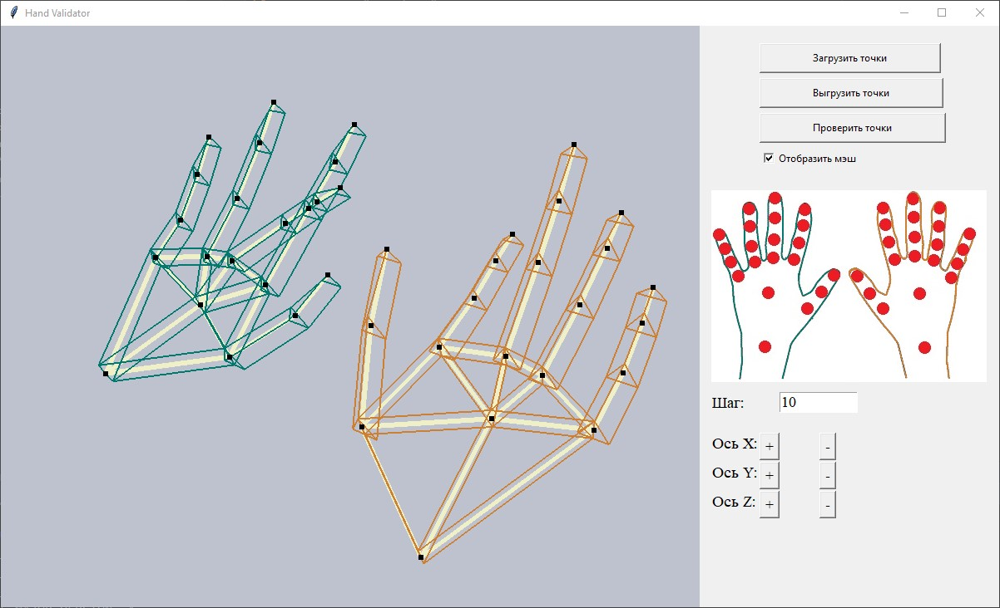

# Моделирование кистей рук с использованием Prolog

## Описание
Программа моделирует и отображает кисти рук человека по заданным точкам костей. В программу входят два модуля:
1. Модуль моделирования и отображения кистей рук на основе точек костей. Написан на языке Python с использованием библиотек tkinter и OpenGL.
2. Модуль проверки корректности подаваемых точек. Написан на языке Prolog. Передаёт информацию о некорретных точках модуль отображения, который в свою очередь отражает это специальной подсветкой.
3. Модуль взаимодействия модулей отображения и проверки. Написан на языке Python с применением библиотеки PySwip для связи программы на Python с программой на SWI-Prolog.

Подробное описание написанной программы содержится в [отчёте](./report/report.pdf) по данной работе.

## Скриншоты

## Установка

Для сборки проекта требуется установить [Python 3](https://www.python.org/downloads/) вместе со следующими библиотеками:
- <a href="https://docs.python.org/3/library/tkinter.html">tkinter</a>
- <a href="https://pillow.readthedocs.io/en/stable/">PIL</a>
- <a href="https://pypi.org/project/PyOpenGL/">PyOpenGL</a>
- <a href="https://pypi.org/project/pyswip/">PySwip</a>

После установки всех необходимых средств через компилятор Python3 нужно запустить app.py.
